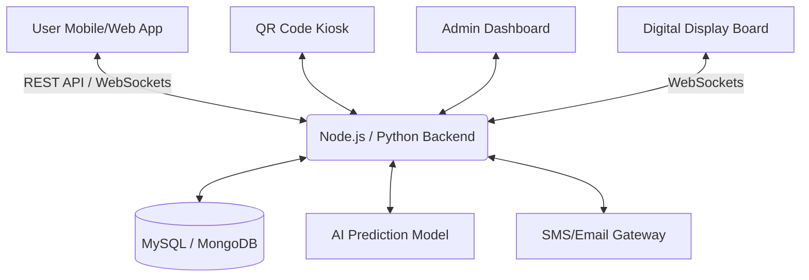
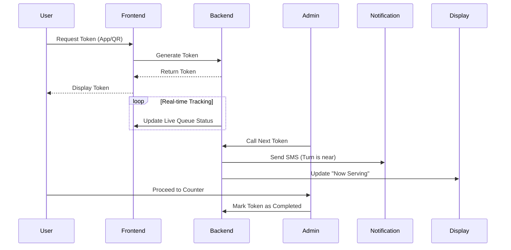

# Digital Queue Management System (DQMS)
**A modern, AI-powered digital queuing solution for hospitals, banks, and college offices.**

---

## 1. Abstract
The Digital Queue Management System (DQMS) is an innovative, cloud-based platform designed to eliminate the frustration, overcrowding, and inefficiency associated with physical waiting lines. By leveraging mobile technologies, real-time data synchronization, and optional AI-based waiting time predictions, DQMS provides users with exact token numbers and live queue tracking. This system enhances user experience and significantly optimizes operational workflows for institutions like hospitals, banks, and universities.

---

## 2. Project Overview
In public service environments, unpredictable waiting times lead to dissatisfaction and poor crowd control. DQMS solves this by moving the queueing process entirely online or via digital kiosks. 

### Key Features
- **Online token generation**: Book tokens from a mobile app before arriving.
- **Real-time queue tracking**: See exact live status.
- **Estimated waiting time**: AI-driven calculations based on average service durations.
- **SMS/email/app notifications**: Receive alerts when your turn is approaching.
- **Admin dashboard**: Comprehensive control panel for staff to manage the queue.
- **Priority queue**: Dedicated handling for emergency cases (e.g., in hospitals).
- **QR code check-in**: Scan to confirm arrival.
- **Digital display board**: Integration for physical waiting areas.

---

## 3. UI Mockups & Design Requirements
The design follows a **futuristic, clean, and professional blue and white theme**.

### 📱 User Dashboard (Mobile App)
*Shows the user's current token, live status, and estimated waiting time.*

### 💻 Admin Management Panel
*A dashboard with statistics, active tokens, and manual controls.*

### 📺 Digital Display Board
*For physical waiting areas, displaying the current token being served clearly.*

---

## 4. System Architecture

---

## 5. Workflow Diagram

---

## 6. Presentation Slides Outline

Here is a 10-slide outline ready to be copy-pasted into your presentation software:

**Slide 1: Title Slide**
- **Title:** Digital Queue Management System (DQMS)
- **Subtitle:** Smarter Waiting for Hospitals, Banks & Colleges
- **Visual:** Project Logo / User Dashboard Mockup

**Slide 2: The Problem**
- **Bullet Points:** Long physical queues, unknown waiting times, overcrowding, customer frustration, and poor administrative control.
- **Visual:** Icons of a crowded waiting room vs. a frustrated clock.

**Slide 3: The Solution (Objective)**
- **Bullet Points:** A smart digital system allowing online booking, live status tracking, and automated notifications.
- **Visual:** Workflow icon connecting a smartphone to a service desk.

**Slide 4: Key Features**
- **Bullet Points:** Online Token Generation, Real-Time Tracking, Estimated Wait Time, SMS/App Notifications, Priority Queues.

**Slide 5: System Architecture**
- **Visual:** (Paste the Mermaid System Architecture diagram from Section 4)
- **Description:** Frontend (React), Backend (Node.js/Python), Database (MongoDB), Notifications.

**Slide 6: User Journey (Workflow)**
- **Visual:** (Paste the Mermaid Workflow diagram from Section 5)
- **Description:** From token generation to service completion.

**Slide 7: UI & Design Mockups**
- **Visual:** Show the 3 generated mockups side-by-side (Mobile, Admin, Display Board).
- **Description:** Highlighting the futuristic, blue-and-white professional theme.

**Slide 8: Benefits & Target Users**
- **Benefits:** Saves time, reduces crowding, improves efficiency.
- **Target Users:** Hospitals, Banks, Colleges, Government Offices.

**Slide 9: Future Enhancements**
- **Bullet Points:** Advanced AI for hyper-accurate wait times, multi-branch scaling, voice-assistant integration, and automated load balancing.

**Slide 10: Conclusion & Q&A**
- **Conclusion:** DQMS transforms the frustrating waiting experience into a seamless, digital journey.
- **Text:** Thank You! Any Questions?

---

## 7. Conclusion
The Digital Queue Management System provides a highly practical, scalable, and modern solution to an age-old problem. By digitizing the queue process, businesses and institutions can optimize their resources while offering users a seamless, stress-free experience. The integration of modern web technologies, real-time databases, and automated notifications makes this project highly relevant for today's digital transformation needs.

---

## 8. Future Enhancements
- **Advanced AI Prediction:** Using machine learning to analyze historical data, employee efficiency, and time-of-day to predict wait times down to the minute.
- **Multi-Branch Integration:** Allowing users to see queue lengths at various hospital/bank branches and routing them to the least crowded one.
- **Voice Assistant Integration:** Allowing users to book tokens via Alexa, Google Assistant, or Siri.
- **Automated Load Balancing:** Automatically re-assigning tokens across multiple active counters if one counter is moving slower than expected.
